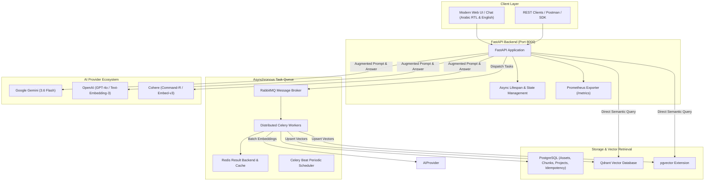

# 🚀 NexusRAG: Enterprise Asynchronous Retrieval-Augmented Generation Platform

<p align="center">
  
  
  
  
  
  
  
</p>

---

## 📌 Overview

**NexusRAG** is a production-grade, distributed, and highly modular **Retrieval-Augmented Generation (RAG)** platform. Built with **FastAPI**, **Celery**, and **PostgreSQL (pgvector) / Qdrant**, it enables high-throughput document ingestion, intelligent semantic search, and context-grounded question answering across large-scale document repositories.

Designed with **Senior AI Engineering** principles in mind:
- **Zero-blocking Architecture:** Heavy document parsing and embedding computation are delegated to Celery workers with RabbitMQ and Redis.
- **Provider Agnostic:** Plug-and-play abstraction for LLM generation and dense embeddings across **Google Gemini**, **OpenAI**, and **Cohere**.
- **Dual Vector Storage:** Choose between embedded/distributed **Qdrant** or **pgvector** in PostgreSQL depending on your infrastructure requirements.
- **Enterprise Reliability:** Built-in idempotency management, sliding-window text chunking with overlap, automatic retries, and comprehensive Prometheus observability.

---

## 🏗️ System Architecture



---

## ✨ Key Features

| Feature | Description |
| :--- | :--- |
| **Multi-Provider LLM Engine** | Unified provider interface supporting **Google Gemini**, **OpenAI**, and **Cohere** for generation and embeddings. |
| **Flexible Vector Store** | Seamless runtime switching between **Qdrant** (embedded/client) and **PostgreSQL with pgvector**. |
| **Distributed Task Pipeline** | Chained Celery workflows (`file_processing` $\rightarrow$ `data_indexing`) preventing HTTP request timeouts. |
| **Robust Sliding-Window Chunking** | Document chunking with configurable `chunk_size` and true `overlap_size` preserving sentence coherence and metadata. |
| **Database-Backed Idempotency** | SHA-256 hashed task arguments preventing duplicate processing with automatic detection of stuck tasks. |
| **Full Observability** | Native Prometheus metrics endpoint (`/metrics`) pre-integrated with Grafana dashboards. |
| **Interactive Chat Interface** | Built-in Arabic (RTL) and English chat application with file upload modal, markdown rendering, and project switching. |
| **Interactive API Documentation** | Auto-generated Swagger UI (`/docs`) and ReDoc (`/redoc`) specifications. |

---

## 📂 Project Structure

```text
nexus-rag/
├── docker/                             # Docker deployment configurations
│   ├── docker-compose.yml              # Multi-container orchestration (FastAPI, Celery, Postgres, RabbitMQ, Redis, Prometheus, Grafana)
│   ├── minirag/                        # Application container Dockerfile & entrypoints
│   ├── nginx/                          # Reverse proxy configuration
│   └── prometheus/                     # Prometheus monitoring configuration
├── src/
│   ├── assets/                         # Uploaded files and local databases
│   ├── controllers/                    # Core business logic
│   │   ├── BaseController.py           # Shared paths & configuration base
│   │   ├── DataController.py           # File validation & secure upload management
│   │   ├── NLPController.py            # RAG orchestration, semantic search & answering
│   │   ├── ProcessController.py        # Sliding-window document chunking & parsing
│   │   └── ProjectController.py        # Workspace & project directory isolation
│   ├── helpers/                        # Configuration & environmental settings
│   │   └── config.py                   # Pydantic Settings singleton with validation
│   ├── models/                         # Database models & access layers
│   │   ├── AssetModel.py               # File assets repository
│   │   ├── ChunkModel.py               # Text chunk repository
│   │   ├── ProjectModel.py             # Project workspaces repository
│   │   └── db_schemes/                 # SQLAlchemy ORM declarations & Alembic migrations
│   ├── routes/                         # FastAPI modular routers
│   │   ├── base.py                     # Health checks & system info
│   │   ├── data.py                     # File upload & processing endpoints
│   │   └── nlp.py                      # Vector search, indexing & RAG answer endpoints
│   ├── static/                         # Frontend Chat Web UI
│   │   └── index.html                  # Responsive Arabic RTL chat interface
│   ├── stores/                         # External provider abstractions
│   │   ├── llm/                        # LLM provider factory & implementations (Gemini, OpenAI, Cohere)
│   │   └── vectordb/                   # Vector DB factory & implementations (Qdrant, pgvector)
│   ├── tasks/                          # Celery background workers & periodic tasks
│   │   ├── data_indexing.py            # Vector embedding & indexing task
│   │   ├── file_processing.py          # Document parsing & chunking task
│   │   ├── process_workflow.py         # End-to-end chained pipeline workflow
│   │   └── maintenance.py              # Automated pruning of old execution records
│   ├── utils/                          # Common utilities
│   │   ├── async_runner.py             # Safe asynchronous coroutine execution
│   │   ├── idempotency_manager.py      # Database task idempotency guard
│   │   └── metrics.py                  # Prometheus instrumentation
│   ├── celery_app.py                   # Celery application & worker configuration
│   └── main.py                         # FastAPI main entrypoint with lifespan
├── .env.example                        # Template environment variables
├── requirements.txt                    # Project production dependencies
└── README.md                           # Project documentation
```

---

## ⚡ Quickstart Guide

### Option 1: Docker Compose (Recommended for Production)

Launch the entire stack (FastAPI, Celery Worker, Celery Beat, PostgreSQL + pgvector, RabbitMQ, Redis, Flower, Prometheus, Grafana) with a single command:

```bash
# 1. Clone repository
git clone https://github.com/your-username/nexus-rag.git
cd nexus-rag

# 2. Configure environment
cp .env.example .env
# Edit .env and insert your API keys (e.g., GEMINI_API_KEY or OPENAI_API_KEY)

# 3. Launch Docker Compose services
cd docker
cp ../.env .env
docker compose up -d --build
```

#### Access Running Services:
| Service | URL | Default Credentials |
| :--- | :--- | :--- |
| **Interactive Chat UI** | [http://localhost:8000/](http://localhost:8000/) | — |
| **FastAPI Swagger Docs** | [http://localhost:8000/docs](http://localhost:8000/docs) | — |
| **Flower Dashboard** | [http://localhost:5555](http://localhost:5555) | `admin` / from `.env` |
| **Prometheus Metrics** | [http://localhost:9090](http://localhost:9090) | — |
| **Grafana Dashboards** | [http://localhost:3000](http://localhost:3000) | `admin` / `admin` |

---

### Option 2: Local Development Setup

#### 1. System Requirements
- Python 3.10+ (tested on Python 3.10, 3.11, 3.12)
- PostgreSQL with `pgvector` extension (or use local Qdrant embedded mode)
- RabbitMQ & Redis (optional if running Celery in eager mode)

#### 2. Virtual Environment Setup
```bash
# Create and activate virtual environment
python -m venv venv

# On Linux/macOS:
source venv/bin/activate
# On Windows:
.\venv\Scripts\activate

# Install dependencies
pip install -r requirements.txt
```

#### 3. Database Migrations
```bash
# Navigate to database migrations folder and upgrade
cd src/models/db_schemes/minirag
alembic upgrade head
cd ../../../..
```

#### 4. Run Development Server
```bash
# Start FastAPI server
cd src
uvicorn main:app --reload --host 0.0.0.0 --port 8000
```

#### 5. Run Celery Services (Separate Terminals)
```bash
# Terminal 1: Celery Worker
python -m celery -A celery_app worker --queues=default,file_processing,data_indexing --loglevel=info

# Terminal 2: Celery Beat Scheduler
python -m celery -A celery_app beat --loglevel=info

# Terminal 3: Flower Monitor
python -m celery -A celery_app flower --conf=flowerconfig.py
```

---

## ⚙️ Configuration Reference

Key variables in `.env`:

| Variable | Default | Description |
| :--- | :--- | :--- |
| `APP_NAME` | `NexusRAG` | Name displayed across UI and metadata |
| `APP_VERSION` | `1.0.0` | Active semantic version |
| `GENERATION_BACKEND` | `GEMINI` | Generation LLM (`GEMINI`, `OPENAI`, `COHERE`) |
| `EMBEDDING_BACKEND` | `GEMINI` | Embedding model provider (`GEMINI`, `OPENAI`, `COHERE`) |
| `GEMINI_API_KEY` | — | Google AI Studio API key |
| `OPENAI_API_KEY` | — | OpenAI API key |
| `COHERE_API_KEY` | — | Cohere API key |
| `VECTOR_DB_BACKEND` | `QDRANT` | Vector database backend (`QDRANT`, `PGVECTOR`) |
| `VECTOR_DB_PATH` | `qdrant_db` | Storage path for local embedded Qdrant |
| `CELERY_BROKER_URL` | `amqp://...` | RabbitMQ connection URI |
| `CELERY_RESULT_BACKEND` | `redis://...` | Redis backend connection URI |
| `CELERY_TASK_ALWAYS_EAGER` | `false` | Run Celery tasks synchronously (useful for local testing) |

---

## 📡 REST API Reference

### Health & Info
- **`GET /api/v1/`** — Retrieve application status, active version, and configured backends.
- **`GET /metrics`** — Prometheus performance and latency metrics.

### Ingestion & Processing (`/api/v1/data`)
- **`POST /api/v1/data/upload/{project_id}`** — Upload a document (`.pdf` or `.txt`) into a project workspace.
- **`POST /api/v1/data/process/{project_id}`** — Parse and chunk uploaded files asynchronously into PostgreSQL.
- **`POST /api/v1/data/process-and-push/{project_id}`** — End-to-end pipeline: chunks documents and pushes embeddings to vector store.

### NLP & Retrieval (`/api/v1/nlp`)
- **`POST /api/v1/nlp/index/push/{project_id}`** — Trigger asynchronous embedding and vector indexing for a project.
- **`GET /api/v1/nlp/index/info/{project_id}`** — Retrieve vector database collection stats and dimensions.
- **`POST /api/v1/nlp/index/search/{project_id}`** — Perform semantic vector similarity search with top-K retrieval.
- **`POST /api/v1/nlp/index/answer/{project_id}`** — Execute full RAG pipeline to generate context-grounded answers.

---

## 🧪 Postman Collection

A complete Postman collection with pre-configured requests is available at:
[`/src/assets/mini-rag-app.postman_collection.json`](file:///c:/Users/Zikola/Desktop/mini-rag-tut-017/src/assets/mini-rag-app.postman_collection.json)

---

## 🎓 Original Tutorial Course & Credits

This project was originally created as an educational tutorial series in Arabic by **Bakrianoo**, explaining how to build a production-level RAG application step by step. We gratefully acknowledge the author for the foundational architecture and educational content.

<details>
<summary><b>📺 Click to expand full video course playlist (25 Lessons)</b></summary>

| # | Lesson Title | Video Link |
|---|---|---|
| 1 | About the Course ماذا ولمـــاذا | [Watch Video](https://www.youtube.com/watch?v=Vv6e2Rb1Q6w&list=PLvLvlVqNQGHCUR2p0b8a0QpVjDUg50wQj) |
| 2 | What will we build ماذا سنبنى في المشروع | [Watch Video](https://www.youtube.com/watch?v=_l5S5CdxE-Q&list=PLvLvlVqNQGHCUR2p0b8a0QpVjDUg50wQj&index=2) |
| 3 | Setup your tools الأدوات الأساسية | [Watch Video](https://www.youtube.com/watch?v=VSFbkFRAT4w&list=PLvLvlVqNQGHCUR2p0b8a0QpVjDUg50wQj&index=3) |
| 4 | Project Architecture | [Watch Video](https://www.youtube.com/watch?v=Ei_nBwBbFUQ&list=PLvLvlVqNQGHCUR2p0b8a0QpVjDUg50wQj&index=4) |
| 5 | Welcome to FastAPI | [Watch Video](https://www.youtube.com/watch?v=cpOuCdzN_Mo&list=PLvLvlVqNQGHCUR2p0b8a0QpVjDUg50wQj&index=5) |
| 6 | Nested Routes + Env Values | [Watch Video](https://www.youtube.com/watch?v=CrR2Bz2Y7Hw&list=PLvLvlVqNQGHCUR2p0b8a0QpVjDUg50wQj&index=6) |
| 7 | Uploading a File | [Watch Video](https://www.youtube.com/watch?v=5alMKCbFqWs&list=PLvLvlVqNQGHCUR2p0b8a0QpVjDUg50wQj&index=7) |
| 8 | File Processing | [Watch Video](https://www.youtube.com/watch?v=gQgr2iwtSBw) |
| 9 | Docker - MongoDB - Motor | [Watch Video](https://www.youtube.com/watch?v=2NOKWm0xJAk) |
| 10 | Mongo Schemes and Models | [Watch Video](https://www.youtube.com/watch?v=zgcnnMJXXV8) |
| 11 | Mongo Indexing | [Watch Video](https://www.youtube.com/watch?v=iO8FAmUVcjE) |
| 12 | Data Pipeline Enhancements | [Watch Video](https://www.youtube.com/watch?v=4x1DuezZBDU) |
| 13 | Checkpoint-1 | [Watch Video](https://www.youtube.com/watch?v=7xIsZkCisPk) |
| 14 | LLM Factory | [Watch Video](https://www.youtube.com/watch?v=5TKRIFtIQAY) |
| 15 | Vector DB Factory | [Watch Video](https://www.youtube.com/watch?v=JtS9UkvF_10) |
| 16 | Semantic Search | [Watch Video](https://www.youtube.com/watch?v=V3swQKokJW8) |
| 17 | Augmented Answers | [Watch Video](https://www.youtube.com/watch?v=1Wx8BoM5pLU) |
| 18 | Checkpoint-1 + Fix Issues | [Watch Video](https://youtu.be/6zG4Idxldvg) |
| 19 | Ollama Local LLM Server | [Watch Video](https://youtu.be/-epZ1hAAtrs) |
| 20 | From Mongo to Postgres + SQLAlchemy & Alembic | [Watch Video](https://www.youtube.com/watch?v=BVOq7Ek2Up0) |
| 21 | The way to PgVector | [Watch Video](https://www.youtube.com/watch?v=g99yq5zlYAE) |
| 22 | App Deployments 1/2 | [Watch Video](https://www.youtube.com/watch?v=7QRPnAbVssg) |
| 23 | App Deployments 2/2 | [Watch Video](https://www.youtube.com/watch?v=qJ5Hdyc4hDc) |
| 24 | Celery Workers 1/2 | [Watch Video](https://www.youtube.com/watch?v=pX-iWWT2TJo) |
| 25 | Celery Workers 2/2 | [Watch Video](https://www.youtube.com/watch?v=SZ5Aznjf8Kc) |

</details>

---

## 📄 License

This project is licensed under the **MIT License**. See the [LICENSE](LICENSE) file for details.
